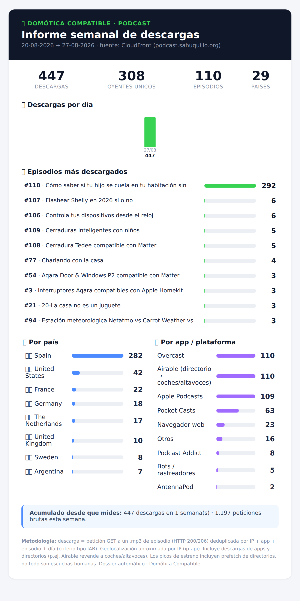

# cf-podcast-stats

**Weekly download analytics for a self-hosted podcast on Amazon S3 + CloudFront — delivered as a nice HTML email.**

If you host your podcast MP3s yourself (S3 behind a CloudFront distribution) instead of using
Spotify for Podcasters / Podbean / Buzzsprout, you lose the pretty download dashboard those
platforms give you. But the data is right there in your **CloudFront access logs**. This tool
parses those logs and emails you a weekly dossier that looks like a real podcast platform:
deduplicated downloads, top episodes, listeners by country, by app, a daily trend and a
running all‑time total.

It's intentionally small (one Python file, standard library + the AWS CLI) and easy to self‑host.



---

## What you get, every week

- **Downloads** — IAB‑style deduplicated (per IP + app + episode + day), not raw hits.
- **Unique listeners**, **episode count**, **country count** as headline KPIs.
- **Downloads per day** mini bar chart.
- **Top episodes** (with real titles if you point it at your RSS feed).
- **By country** (geolocated from the listener IP, with flags).
- **By app / platform** — Apple Podcasts, Spotify, Overcast, Pocket Casts, Castbox, AntennaPod,
  Amazon/Alexa, directory aggregators like Airable, web browsers, bots…
- **All‑time total** accumulated across every weekly run.
- A short **methodology** note so you (or a sponsor) understand exactly what's counted.

It's a real, defensible number you can hand to an advertiser or a network.

---

## How it works

1. CloudFront writes **standard access logs** (gzipped, tab‑separated) to an S3 bucket.
2. Once a week a timer runs `weekly_report.py`, which:
   - downloads the last *N* days of logs from S3 (`aws s3 cp`),
   - keeps only `GET` requests to `*.mp3` episode files with HTTP `200`/`206`,
   - deduplicates them the IAB way, classifies the user‑agent, geolocates the IP,
   - resolves episode titles from your RSS feed (optional),
   - renders an HTML dossier and emails it (Gmail API **or** any SMTP server).

No database, no third‑party analytics service, no tracking pixel. Your listeners' data never
leaves your infrastructure except for a batched IP→country lookup (which you can disable).

---

## Setup

### 1. Enable CloudFront standard logging

In the CloudFront distribution that serves your podcast (e.g. `podcast.example.com`), turn on
**Standard logging** and point it at an S3 bucket + optional prefix. Wait a few hours for logs
to appear (CloudFront delivers them with some delay).

### 2. Give the machine read access to the log bucket

The machine that runs the report needs `s3:GetObject` + `s3:ListBucket` on the log bucket.
On EC2, attach an IAM policy to the instance role — see [`docs/iam-policy.example.json`](docs/iam-policy.example.json).
Off‑AWS, configure the AWS CLI with credentials that can read the bucket.

### 3. Install

```bash
git clone https://github.com/csahuquillo/cf-podcast-stats.git /opt/cf-podcast-stats
cd /opt/cf-podcast-stats
python3 -m venv venv
# Only needed if you send via the Gmail API (SMTP needs nothing extra):
./venv/bin/pip install -r requirements.txt
```

The AWS CLI (`aws`) must be installed and able to read the log bucket.

### 4. Configure

```bash
cp config.example.env .env
$EDITOR .env
```

Minimum: `CFPS_LOG_BUCKET`, `CFPS_EMAIL_TO`, and your email method. See
[`config.example.env`](config.example.env) for every option (episode‑id regex, brand, RSS feed
for titles, geoip on/off, etc.).

**Email:** pick one of
- `CFPS_EMAIL_METHOD=smtp` — works with any SMTP server (Gmail app password, Fastmail, your own…).
- `CFPS_EMAIL_METHOD=gmail_api` — use a Google OAuth token json with the `gmail.send` scope.
- `CFPS_EMAIL_METHOD=none` — write the HTML to `state/last_report.html` instead of emailing.

### 5. Test it

```bash
./venv/bin/python weekly_report.py --test
```

`--test` sends a `[TEST]` email and does **not** update the all‑time counter.

### 6. Schedule it (Sunday night)

**systemd** (recommended) — copy and enable the provided units:

```bash
sudo cp systemd/cf-podcast-stats.service systemd/cf-podcast-stats.timer /etc/systemd/system/
sudo systemctl daemon-reload
sudo systemctl enable --now cf-podcast-stats.timer
systemctl list-timers cf-podcast-stats.timer
```

**cron** alternative:

```cron
0 22 * * 0  /opt/cf-podcast-stats/venv/bin/python /opt/cf-podcast-stats/weekly_report.py >> /opt/cf-podcast-stats/state/cron.log 2>&1
```

---

## Configuration reference

| Variable | Meaning |
|---|---|
| `CFPS_LOG_BUCKET` | S3 bucket with the CloudFront logs (**required**) |
| `CFPS_LOG_PREFIX` | key prefix inside the bucket (optional) |
| `CFPS_EPISODE_REGEX` | regex whose first group is the episode id in the URI (default `/([^/]+?)\.mp3`) |
| `CFPS_WINDOW_DAYS` | rolling window per report (default `7`) |
| `CFPS_BRAND` | podcast name shown in the email |
| `CFPS_CF_HOST` | your podcast host, shown in the header |
| `CFPS_FEED_URL` | RSS URL to resolve episode titles (optional) |
| `CFPS_GEOIP` | `1` = geolocate via ip‑api.com (free); `0` = skip |
| `CFPS_STATE_DIR` | cache/state/log dir (default `./state`) |
| `CFPS_EMAIL_TO` / `CFPS_EMAIL_FROM` | recipient / sender |
| `CFPS_EMAIL_METHOD` | `smtp` \| `gmail_api` \| `none` |
| `CFPS_SMTP_*` | SMTP host/port/tls/user/pass |
| `CFPS_GOOGLE_TOKEN` | path to a Gmail OAuth token (for `gmail_api`) |

---

## Methodology & limitations

- A **download** is a `GET` to an episode `.mp3` returning `200`/`206`, deduplicated by
  **IP + app + episode + day** — the common IAB‑style rule. This is stricter than "raw requests"
  (a single listen can be several `206` range requests) and looser than "confirmed human plays".
- **Geolocation** is approximate (IP → country via [ip‑api.com](https://ip-api.com), free tier,
  cached). Disable with `CFPS_GEOIP=0`.
- **Release‑day spikes** include directory/aggregator prefetch (Apple, Airable, etc.) fetching the
  new episode — that's normal and counts as a download in every platform, but it's not all humans.
- CloudFront logs are **delayed** (up to ~24h) and only exist from the moment you enabled logging.
- The all‑time total starts from your first run; there's no back‑fill of history you never logged.

## Why not just use `<hosting platform>`?

Because you already host on S3 + CloudFront (cheap, no lock‑in, you own the feed and the files),
and the download data is sitting in your own bucket. This turns it into the dashboard you'd
otherwise pay a platform for — in ~400 lines you fully control.

## License

MIT — see [LICENSE](LICENSE). Contributions welcome.
